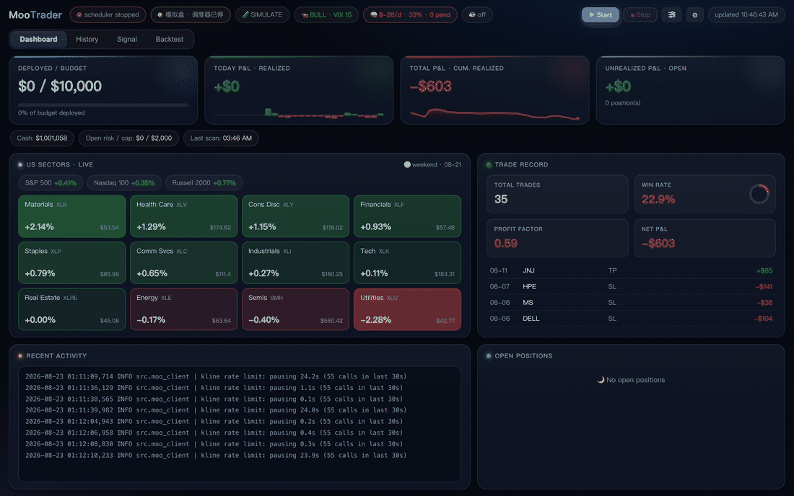
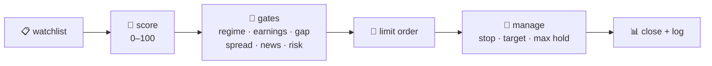
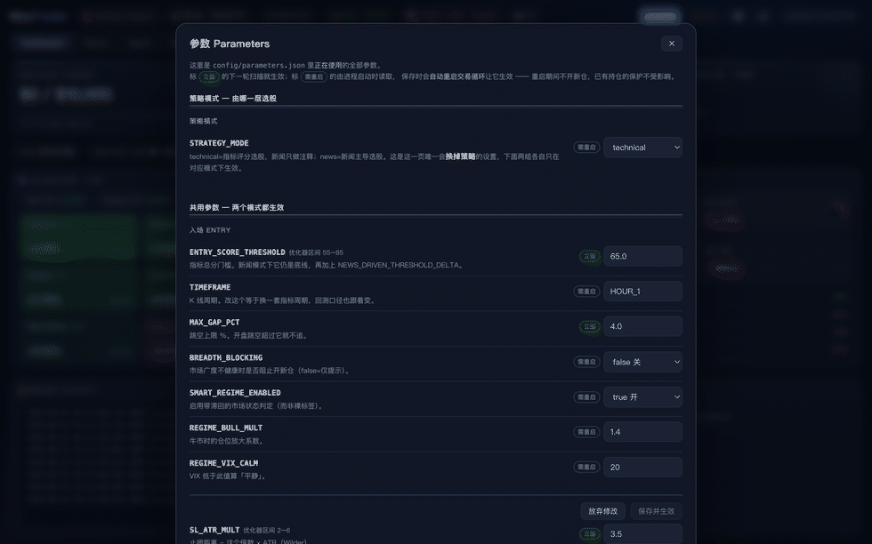

<div align="center">

# 📈 Moo Trader

**A self-hosted, AI-assisted swing-trading bot for US stocks — you run it from your browser.**

[](https://github.com/ethan6945/MooTrader/releases/latest)


English · [简体中文](README.zh-CN.md)

</div>

<p align="center">
  
  <br/>
  <em>The whole thing is a web panel — dashboard, history, signal desk. This is a paper account.</em>
</p>

> [!WARNING]
> **Trading can lose you real money.** This program guarantees nothing. Paper-trade it for weeks before you even consider real money, and never deploy more than you can afford to lose.

---

## What it does

During US market hours it works one list of stocks on a loop:



Everything runs on your own Mac, against your own broker account through the official OpenD gateway. **Paper trading is the default** — switching to real money takes a deliberate step in the panel (trade password, no open positions, second confirmation).

You don't drive it from a terminal. You open the panel, press **▶ Start**, and then mostly read Telegram: it pushes every fill, stop and status change, and asks for a yes/no when the optimizer wants to change a parameter.

**What it is good for:** running a rule-based strategy without sitting at the screen, and seeing exactly why every order happened. **What it is not:** a signal service, a money printer, or anything you should point at money you need.

---

## Features

- **Multi-strategy scoring** — trend and momentum-breakout score every name 0–100; only the strong ones become candidates (mean-reversion and pattern strategies ship switched off until a backtest says otherwise).
- **Gates before orders** — market regime, earnings dates, overnight gaps, bid-ask spread, a blacklist for repeat losers, drawdown halts and per-trade risk caps. Fail one, the name is dropped.
- **AI as context, not as the trigger** — DeepSeek reads real-time news for each candidate (Tavily/Finnhub + a local FinBERT score). It annotates and can flag, but by default it never overrides the rules, so live trading stays comparable with the backtest.
- **Risk you set once** — budget cap, risk per trade, position count and size limits, daily-drawdown stop. The AI cannot raise any of them.
- **Gap sentinel** — a stop order can't protect you overnight. Before the open it checks earnings and hard bad news on what you hold, and liquidates at the open if needed.
- **Honest backtesting** — one engine (`backtest_v4`) simulates the account step by step the way live runs, so the numbers mean something. A tuner proposes parameter changes; the ones outside the guardrails wait for your approval.
- **Everything is logged** — every order, every gate that fired, every parameter change with who changed it and why.

---

## The panel

<p align="center">
  
</p>

| Tab | What's there |
|---|---|
| **Dashboard** | Budget, P&L, cash and open risk; a live US-sector heatmap; trade record; activity log; open positions with their stop→target range |
| **History** | Equity curve, monthly P&L, and every closed trade with its exit reason and R multiple |
| **Signal** | A watch desk that scans your list every 5 minutes for breakouts, volume spikes, VWAP flips and RSI extremes, and pushes them to Telegram |
| **Backtest** | Run the engine over a window and read the result |
| **⚙ Settings** | Paper/live switch, API keys, theme, EN/中文, panel access |
| **Parameters** | Every strategy parameter with a plain-language description, which ones take effect on the next scan, and which need a restart |

Set a panel password in Settings and flip on LAN access, and the same panel opens on your phone over WiFi (or Tailscale).

---

## Getting started

**You need:** a Mac (macOS 14+), a moomoo/Futu account with paper trading enabled, and the **OpenD** gateway installed and logged in — the bot talks to it on `127.0.0.1:11111`. There is no way around that step. A [DeepSeek](https://platform.deepseek.com) key powers the AI parts; [Tavily](https://app.tavily.com) (news) and a [Telegram bot](https://t.me/BotFather) are optional but recommended.

```bash
git clone https://github.com/ethan6945/MooTrader.git
cd MooTrader
uv venv --python 3.11 && uv pip install -r requirements.txt
cp .env.example .env      # fill in your keys — every line is documented
./start-web.command
```

`start-web.command` brings up OpenD, starts the panel and opens <http://127.0.0.1:8770>. Press **▶ Start** and it begins trading on paper. `stop-web.command` shuts it all down; closing the browser does not stop trading.

<details>
<summary>CLI equivalents</summary>

```bash
python -m src.main start          # start the trading scheduler
python -m src.main stop           # stop it
python -m src.main scan           # a single scan, for debugging
python -m src.backtest_v4 --days 180
```

</details>

### Prefer an app?

There's a native macOS wrapper in `macos/` (and a `.dmg` on the [releases page](https://github.com/ethan6945/MooTrader/releases/latest)) — same backend, plus a menu-bar status icon and approval notifications. It's a convenience layer; the web panel is where the full feature set lives.

---

## Under the hood

Three processes that don't depend on each other, talking through files in `data/`:

| | |
|---|---|
| **OpenD** | The broker's official gateway. Quotes and orders both go through it |
| **Scheduler** | The part that actually trades. Started by ▶ in the panel, keeps running if you close the browser |
| **Web panel** | Flask. Reads state, writes config, handles approvals — it never places an order itself |

Credentials live in `.env`; strategy parameters live in `config/parameters.json` and are edited in the panel — one file, one source of truth, with every change appended to `config/parameters_history.jsonl`.

**Stack:** Python 3.11 · APScheduler · moomoo-api · pandas + pandas-ta · Optuna · SQLite · Flask · python-telegram-bot · SwiftUI (the optional app).

---

## Disclaimer

A personal research project, not financial advice. Backtests don't predict the future, a regime change can break any strategy, and the author is not liable for any loss you take using this.

## Support

Free and open source, no paywall. A ⭐ helps · [Buy Me a Coffee](https://buymeacoffee.com/ethan6945) · [GitHub Sponsors](https://github.com/sponsors/ethan6945)

## License

[MIT](LICENSE) © 2026
