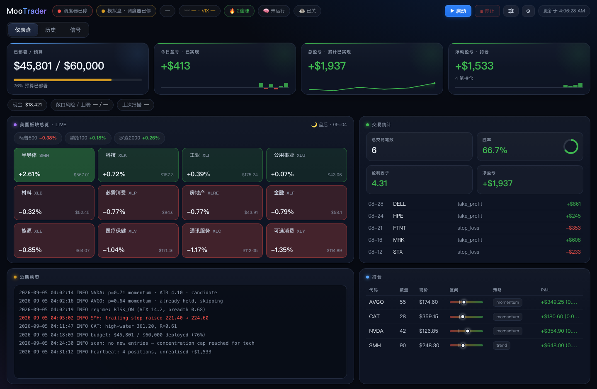
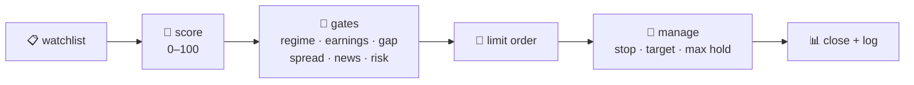
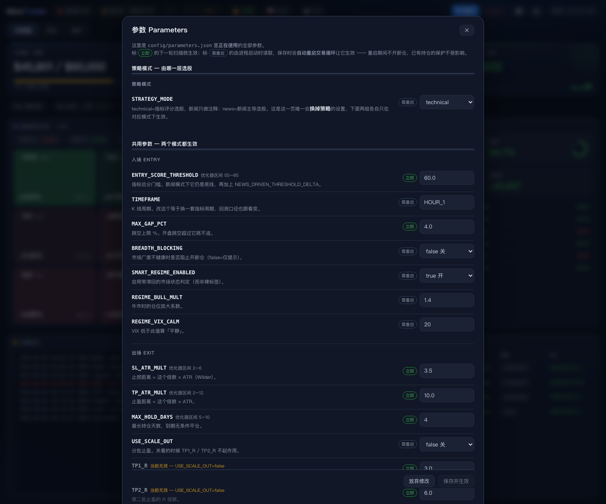
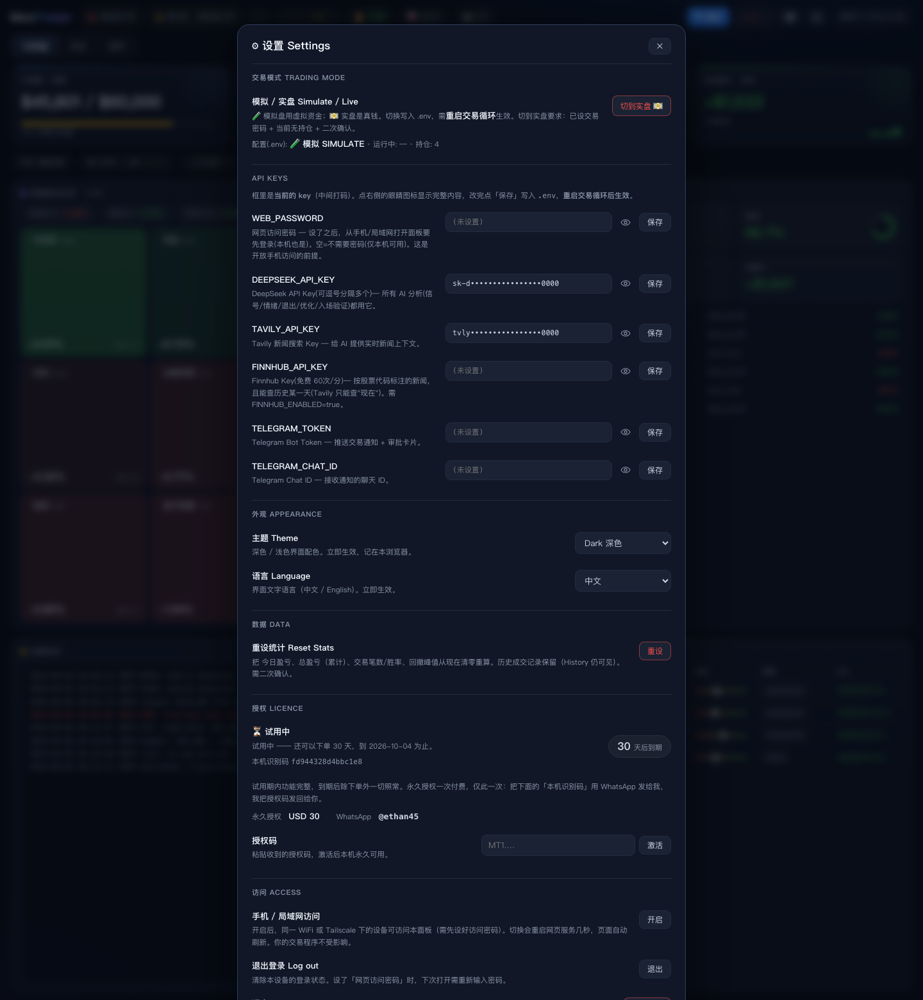

<div align="center">

# 📈 Moo Trader

**A self-hosted, AI-assisted swing-trading bot for US stocks — you run it from your browser.**


English · [简体中文](README.zh-CN.md)

</div>

<p align="center">
  
  <br/>
  <em>The whole thing is a web panel — dashboard, history, signal desk. This is a paper account.</em>
</p>

> [!WARNING]
> **Trading can lose you real money.** This program guarantees nothing. Paper-trade it for weeks before you even consider real money, and never deploy more than you can afford to lose.

---

## What it does

During US market hours it works one list of stocks on a loop:



Everything runs on your own computer — macOS or Windows — against your own broker account through the official OpenD gateway. **Paper trading is the default** — switching to real money takes a deliberate step in the panel (trade password, no open positions, second confirmation).

You don't drive it from a terminal. You open the panel, press **▶ Start**, and then mostly read Telegram: it pushes every fill, stop and status change. Parameters only move when you say so — the tuner runs when you press its button (or weekly, if you switch it), and every change it finds waits for your tick.

**What it is good for:** running a rule-based strategy without sitting at the screen, and seeing exactly why every order happened. **What it is not:** a signal service, a money printer, or anything you should point at money you need.

---

## Features

- **Multi-strategy scoring** — trend and momentum-breakout score every name 0–100; only the strong ones become candidates (mean-reversion and pattern strategies ship switched off until a backtest says otherwise).
- **Gates before orders** — market regime, earnings dates, overnight gaps, bid-ask spread, a blacklist for repeat losers, drawdown halts and per-trade risk caps. Fail one, the name is dropped.
- **AI as context, not as the trigger** — DeepSeek reads real-time news for each candidate (Tavily/Finnhub + a local FinBERT score). It annotates and can flag, but by default it never overrides the rules, so live trading stays comparable with the backtest.
- **Risk you set once** — budget cap, risk per trade, position count and size limits, daily-drawdown stop. The AI cannot raise any of them.
- **Gap sentinel** — a stop order can't protect you overnight. Before the open it checks earnings and hard bad news on what you hold, and liquidates at the open if needed.
- **Honest backtesting** — one engine (`backtest_v4`) simulates the account step by step the way live runs, so the numbers mean something. The tuner reads your real fills, asks the AI what to change, backtests each idea, and keeps only what beats your current settings without deepening drawdown. It runs when you press the button; every surviving change is a row you tick or cross before anything is written. Switch it to weekly and it runs itself, with the survivors waiting in the approval queue instead.
- **Everything is logged** — every order, every gate that fired, every parameter change with who changed it and why.

---

## The panel

<p align="center">
  
</p>


| Tab | What's there |
|---|---|
| **Dashboard** | Budget, P&L, cash and open risk; a live US-sector heatmap; trade record; activity log; open positions with their stop→target range |
| **History** | Equity curve, monthly P&L, and every closed trade with its exit reason and R multiple |
| **Signal** | A watch desk that scans your list every 5 minutes for breakouts, volume spikes, VWAP flips and RSI extremes, and pushes them to Telegram |
| **⚙ Settings** | Paper/live switch, API keys, theme, EN/中文, panel access |
| **Parameters** | Every strategy parameter with a plain-language description, which ones take effect on the next scan, and which need a restart — plus the tuning switch (manual / weekly) and the button that runs a tuning pass now |

<p align="center">
  
  
</p>

Set a panel password in Settings and flip on LAN access, and the same panel opens on your phone over WiFi (or Tailscale).

---

## Pricing

**30 days free, with nothing held back.** The trial is the whole program — every
strategy, every panel, live orders included. When it ends the software keeps
running exactly as before, and the one thing that stops is placing orders: it
still scans, scores, forecasts and backtests, so an expired trial tells you what
it *would* have done.

**A lifetime licence is USD 30, paid once.** No subscription, no renewal, no
per-trade cut.

To buy one, open **Settings → Licence** and send me the **machine id** shown
there over WhatsApp — **@ethan45** — and I will send a key back. Paste it into
the same panel and the copy is licensed permanently. The key is issued for that
one computer, so the id is the only thing I need.

---

## Getting started

**Both platforms need the same three things:** a moomoo/Futu account with paper
trading enabled, the **OpenD** gateway installed and logged in (the bot talks to
it on `127.0.0.1:11111` — there is no way around that step), and a
[DeepSeek](https://platform.deepseek.com) key for the AI parts.
[Tavily](https://app.tavily.com) (news) and a
[Telegram bot](https://t.me/BotFather) are optional but recommended.

Download the source archive from
[Releases](https://github.com/ethan6945/MooTrader/releases) — the same archive
on both platforms — and unzip it somewhere you can find again. Everything the
bot writes stays in that folder.

### macOS 14+

```bash
cd MooTrader
uv venv --python 3.11 && uv pip install -r requirements.txt
cp .env.example .env      # fill in your keys — every line is documented
```

Then **double-click `start-web.command`**. It launches OpenD if it is not
already up, waits for the gateway, starts the panel and opens your browser. The
window closes itself; the panel keeps running. **Double-click `stop-web.command`**
to stop everything.

### Windows 10/11

```bat
cd MooTrader
py -3.11 -m venv .venv
.venv\Scripts\pip install -r requirements.txt
copy .env.example .env
```

Open `.env` in Notepad and fill in your keys. **Start OpenD yourself and finish
the login** — unlike the Mac launcher, `start-web.bat` does not open it for you,
because OpenD keeps its own login session and cannot be signed into unattended.

Then **double-click `start-web.bat`**. It checks that OpenD is listening, starts
the panel hidden, and opens your browser. Closing the window leaves the panel
running; **double-click `stop-web.bat`** to stop everything.

> Windows support is new and has not been through a full live session yet. If
> something does not work, tell me — the trial exists partly so you can find out
> before paying.

### Then

The panel opens at `http://127.0.0.1:8770`. Press **▶ Start** to run the trading
loop. It starts in **paper mode**; switching to real money needs your trade
password, no open positions, and a second confirmation.


## Under the hood

Three processes that don't depend on each other, talking through files in `data/`:

| | |
|---|---|
| **OpenD** | The broker's official gateway. Quotes and orders both go through it |
| **Scheduler** | The part that actually trades. Started by ▶ in the panel, keeps running if you close the browser |
| **Web panel** | Flask. Reads state, writes config, handles approvals — it never places an order itself |

Credentials live in `.env`; strategy parameters live in `config/parameters.json` and are edited in the panel — one file, one source of truth, with every change appended to `config/parameters_history.jsonl`.

**Stack:** Python 3.11 · APScheduler · moomoo-api · pandas + pandas-ta · Optuna · SQLite · Flask · python-telegram-bot · SwiftUI (the optional app).

---

## Disclaimer

A personal research project, not financial advice. Backtests don't predict the future, a regime change can break any strategy, and the author is not liable for any loss you take using this.

## License

[Proprietary](LICENSE) © 2026 Ethan Tan — all rights reserved. Versions up to v2.6.1 were released under MIT; that grant stands for those versions only.
