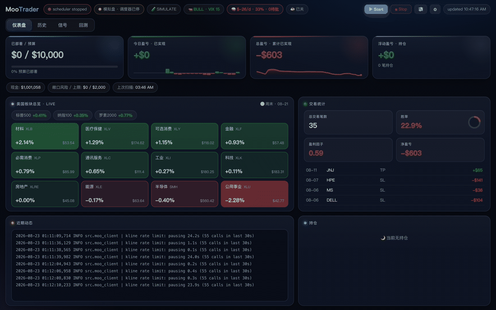
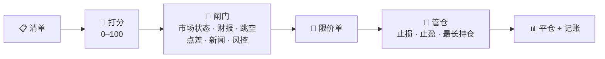
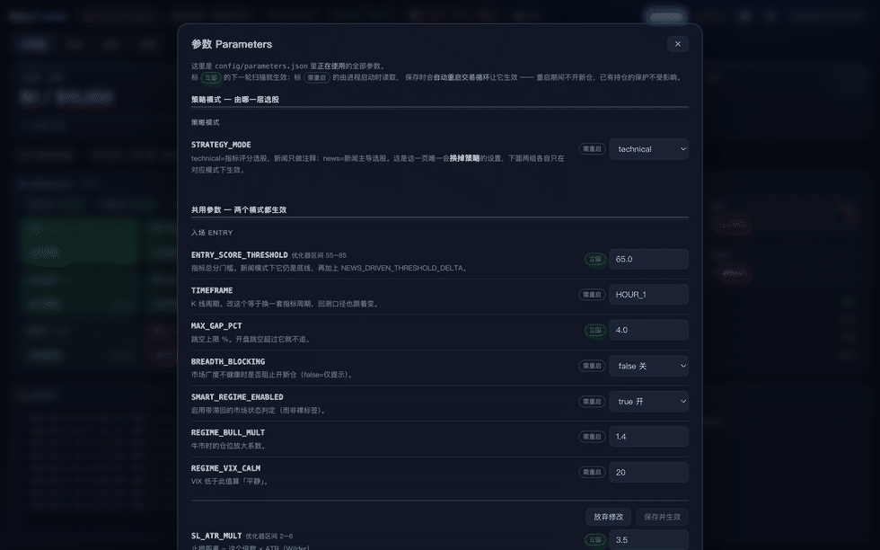

<div align="center">

# 📈 Moo Trader

**自己家里跑的美股短线交易机器人 —— 打开浏览器就能用。**

[](https://github.com/ethan6945/MooTrader/releases/latest)


[English](README.md) · 简体中文

</div>

<p align="center">
  
  <br/>
  <em>整个软件就是这个网页面板 —— 仪表盘、历史、盯盘信号台。图中是模拟盘账户。</em>
</p>

> [!WARNING]
> **交易会真的亏钱。** 这个程序不保证任何收益。先用模拟盘跑上几周，再考虑要不要碰真钱；投入的金额永远只能是亏光也不影响生活的那部分。

---

## 它做什么

美股开盘期间，它对着一份股票清单不停地循环做这件事：



全部跑在你自己的 Mac 上，通过官方 OpenD 网关连你自己的券商账户。**默认是模拟盘** —— 切实盘需要在面板里明确操作一次（交易密码 + 当前无持仓 + 二次确认）。

它不靠命令行操作：打开面板，按 **▶ Start**，剩下的时间基本上只需要看 Telegram —— 每一笔成交、止损、状态变化都会推给你。参数只在你点头之后才动：调参器默认由你按按钮触发（也可以切成每周自动跑），跑出来的每一条改动都要你确认。

**它适合：** 让一套规则替你盯盘下单，并且每一单为什么会发生都查得到。**它不是：** 荐股服务、印钞机，更不是可以拿输不起的钱去试的东西。

---

## 功能

- **多策略打分** —— 趋势和动量突破给每只票打 0–100 分，分够高才成为候选（均值回归、形态识别默认关着，等回测证明它们能加分再开）。
- **下单前先过闸门** —— 市场状态、财报日期、隔夜跳空、买卖价差、屡输标的黑名单、回撤熔断、单笔风险上限。任何一道不过就放弃这只票。
- **AI 只做上下文，不做扳机** —— DeepSeek 读每个候选的实时新闻（Tavily / Finnhub + 本地 FinBERT 打分）。它会标注、会提示，但默认不推翻规则，这样实盘的成交才和回测对得上。
- **风控你说了算** —— 预算上限、单笔风险、持仓数量与单只仓位上限、当日回撤停手。AI 一条也改不动。
- **跳空哨兵** —— 挂单挡不住隔夜跳空。开盘前它会检查持仓的财报和重大坏消息，必要时开盘就清掉。
- **诚实的回测** —— 只有一个引擎（`backtest_v4`），按实盘的方式逐步模拟整个账户，所以跑出来的数字有意义。调参器读你的真实成交、问 AI 该改什么、把每个想法拿去回测，只留下「$/天更高且回撤没变差」的那些。默认由你按按钮触发，跑完每条改动都是一行、你打勾或打叉之后才写入；也可以切成每周自动跑，结果进审批队列等你批。
- **一切留痕** —— 每一单、每一道拦下它的闸门、每一次参数变更（谁改的、为什么）都记在案。

---

## 面板长什么样

<p align="center">
  
</p>

| 页签 | 里面有什么 |
|---|---|
| **仪表盘** | 预算、盈亏、现金和敞口风险；美股板块实时热力图；交易统计；活动日志；持仓和它们的止损→止盈区间 |
| **历史** | 净值曲线、当月盈亏，以及每一笔平仓的离场原因和 R 倍数 |
| **信号** | 盯盘台，盘中每 5 分钟扫描你的清单，突破 / 放量 / VWAP 翻转 / RSI 极值即时推 Telegram |
| **⚙ 设置** | 模拟/实盘切换、API Key、主题、中英文、访问方式 |
| **参数** | 全部策略参数，每一条都有大白话说明，并标明哪些下次扫描就生效、哪些要重启；调参开关（手动 / 每周）和「立即回测调参」按钮也在这一页 |

在设置里设好访问密码、打开「手机 / 局域网访问」，同一个 WiFi（或 Tailscale）下的手机就能开同一个面板。

---

## 怎么跑起来

**需要准备：** 一台 Mac（macOS 14+）、一个开通了模拟交易的 moomoo/富途账户，以及装好并登录的 **OpenD** 网关 —— 机器人是通过 `127.0.0.1:11111` 跟它说话的，这一步绕不过去。AI 部分需要一个 [DeepSeek](https://platform.deepseek.com) key；[Tavily](https://app.tavily.com)（新闻）和 [Telegram bot](https://t.me/BotFather) 可选，但建议配上。

```bash
git clone https://github.com/ethan6945/MooTrader.git
cd MooTrader
uv venv --python 3.11 && uv pip install -r requirements.txt
cp .env.example .env      # 填 key，每一行模板里都有说明
./start-web.command
```

`start-web.command` 会拉起 OpenD、启动面板并打开 <http://127.0.0.1:8770>。按 **▶ Start** 就开始在模拟盘上跑了。要全部停掉用 `stop-web.command`；只关浏览器不会停止交易。

<details>
<summary>对应的命令行</summary>

```bash
python -m src.main start          # 启动交易调度器
python -m src.main stop           # 停掉它
python -m src.main scan           # 只扫一次，调试用
python -m src.backtest_v4 --days 180
```

</details>

### 想要 App？

`macos/` 里有一个原生 macOS 外壳（[releases 页](https://github.com/ethan6945/MooTrader/releases/latest) 有打包好的 `.dmg`）—— 同一个后端，多了菜单栏状态图标和审批通知。它只是个方便的壳子，完整功能还是在网页面板里。

---

## 内部结构

三个互不依赖的进程，通过 `data/` 下的文件互通：

| | |
|---|---|
| **OpenD** | 券商官方网关，行情和下单都走它 |
| **调度器** | 真正在交易的那个进程。面板上按 ▶ 启动，关掉浏览器它照跑 |
| **网页面板** | Flask。读状态、写配置、处理审批 —— 它自己从不下单 |

密钥放在 `.env`；策略参数放在 `config/parameters.json`，在面板里改 —— 一个文件一个来源，每次改动都追加到 `config/parameters_history.jsonl`。

**技术栈：** Python 3.11 · APScheduler · moomoo-api · pandas + pandas-ta · Optuna · SQLite · Flask · python-telegram-bot · SwiftUI（可选的 App）。

---

## 免责声明

个人研究项目，不构成投资建议。回测不能预测未来，市场风格一变任何策略都可能亏钱，作者不对你使用本程序产生的任何损失负责。

## 支持

完全免费开源，没有付费墙。点个 ⭐ 就很好 · [Buy Me a Coffee](https://buymeacoffee.com/ethan6945) · [GitHub Sponsors](https://github.com/sponsors/ethan6945)

## 许可

[MIT](LICENSE) © 2026
