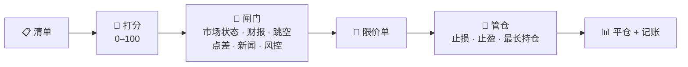

<div align="center">

# 📈 Moo Trader

**美股波段交易机器人。跑在你自己的电脑上，连你自己的券商账户，全程在浏览器面板里操作。**

**30 天免费 · 永久授权 USD 30**


[English](README.md) · 简体中文

</div>

<p align="center">
  
  <br/>
  <em>整个软件就是这个网页面板 —— 仪表盘、历史、盯盘信号台。图中是模拟盘账户。</em>
</p>

> [!WARNING]
> **交易会真的亏钱。** 这个程序不保证任何收益。先用模拟盘跑上几周，再考虑要不要碰真钱；投入的金额永远只能是亏光也不影响生活的那部分。

---

## 它做什么

进出场全部由规则决定。AI 只负责读新闻、写注释，从不扣扳机 —— 这是实盘能和回测对得上的原因。

美股开盘期间，它对着一份股票清单不停地循环做这件事：



你的机器、你的券商账户，走官方 OpenD 网关，数据不发去任何别的地方。**默认模拟盘**，
切实盘要交易密码、当前无持仓、外加二次确认。

不需要碰命令行：打开面板按 **▶ 启动**，然后看 Telegram —— 每一笔成交、止损、状态
变化都会推给你。参数只在你点头之后才动。

**适合：** 让一套规则替你盯盘下单，而且每一单为什么发生都查得到。
**不是：** 荐股服务、印钞机，也不是拿输不起的钱去试的东西。

---

## 功能

- **多策略打分** —— 趋势和动量突破给每只票打 0–100 分，分够高才成为候选（均值回归、形态识别默认关着，等回测证明它们能加分再开）。
- **下单前先过闸门** —— 市场状态、财报日期、隔夜跳空、买卖价差、屡输标的黑名单、回撤熔断、单笔风险上限。任何一道不过就放弃这只票。
- **AI 只做上下文，不做扳机** —— DeepSeek 读每个候选的实时新闻（Tavily / Finnhub + 本地 FinBERT 打分）。它会标注、会提示，但默认不推翻规则，这样实盘的成交才和回测对得上。
- **风控你说了算** —— 预算上限、单笔风险、持仓数量与单只仓位上限、当日回撤停手。AI 一条也改不动。
- **跳空哨兵** —— 挂单挡不住隔夜跳空。开盘前它会检查持仓的财报和重大坏消息，必要时开盘就清掉。
- **诚实的回测** —— 只有一个引擎（`backtest_v4`），按实盘的方式逐步模拟整个账户，所以跑出来的数字有意义。调参器读你的真实成交、问 AI 该改什么、把每个想法拿去回测，只留下「$/天更高且回撤没变差」的那些。默认由你按按钮触发，跑完每条改动都是一行、你打勾或打叉之后才写入；也可以切成每周自动跑，结果进审批队列等你批。
- **一切留痕** —— 每一单、每一道拦下它的闸门、每一次参数变更（谁改的、为什么）都记在案。

---

## 面板长什么样

<p align="center">
  
</p>


| 页签 | 里面有什么 |
|---|---|
| **仪表盘** | 预算、盈亏、现金和敞口风险；美股板块实时热力图；交易统计；活动日志；持仓和它们的止损→止盈区间 |
| **历史** | 净值曲线、当月盈亏，以及每一笔平仓的离场原因和 R 倍数 |
| **信号** | 盯盘台，盘中每 5 分钟扫描你的清单，突破 / 放量 / VWAP 翻转 / RSI 极值即时推 Telegram |
| **⚙ 设置** | 模拟/实盘切换、API Key、主题、中英文、访问方式 |
| **参数** | 全部策略参数，每一条都有大白话说明，并标明哪些下次扫描就生效、哪些要重启；调参开关（手动 / 每周）和「立即回测调参」按钮也在这一页 |

在设置里设好访问密码、打开「手机 / 局域网访问」，同一个 WiFi（或 Tailscale）下的手机就能开同一个面板。

---

## 价格

**30 天免费，功能一点不留。** 试用期就是完整的软件 —— 所有策略、所有面板，包括真实下单。
到期后软件照常运行，唯一停掉的是下单：它仍然会扫描、打分、预测、回测，所以过期的试用版
会告诉你它**本来会**怎么做。

**永久授权 USD 30，一次付清。** 没有订阅、不用续费、不抽成。

购买方式：打开 **设置 → 授权**，把里面显示的**本机识别码**用 WhatsApp 发给我 ——
**@ethan45** —— 我把授权码发回给你。粘贴进同一个面板，这台电脑就永久授权了。
授权码是针对那一台电脑签发的，所以我只需要那个识别码。

---

## 怎么跑起来

**两个平台都需要同样三样东西：** 一个开通了模拟交易的 moomoo/富途账户、装好并登录的
**OpenD** 网关（机器人通过 `127.0.0.1:11111` 跟它说话，这一步绕不过去），以及一个
[DeepSeek](https://platform.deepseek.com) key。[Tavily](https://app.tavily.com)（新闻）
和 [Telegram bot](https://t.me/BotFather) 可选，但建议配上。

从 [Releases](https://github.com/ethan6945/MooTrader/releases) 下载源码压缩包 ——
两个平台是同一个包 —— 解压到一个你找得回来的地方。机器人写的所有东西都留在那个文件夹里。

### macOS 14+

```bash
cd MooTrader-2.7.0
uv venv --python 3.11 && uv pip install -r requirements.txt
cp .env.example .env      # 填 key，每一行模板里都有说明
```

然后**双击 `macos-start-web.command`**。它会在 OpenD 没开的时候帮你打开、等网关就绪、
启动面板并打开浏览器。那个窗口会自己关掉，面板继续在后台跑。
**双击 `macos-stop-web.command`** 停掉全部。

### Windows 10/11

```bat
cd MooTrader-2.7.0
py -3.11 -m venv .venv
.venv\Scripts\pip install -r requirements.txt
copy .env.example .env
```

用记事本打开 `.env` 填好 key。**先自己启动 OpenD 并完成登录** —— 和 Mac 的启动器不同，
`windows-start-web.bat` 不会帮你开 OpenD，因为它有自己的登录会话，没法无人值守地登进去。

然后**双击 `windows-start-web.bat`**。它会先确认 OpenD 在监听，再隐藏启动面板并打开浏览器。
关掉窗口不影响面板运行；**双击 `windows-stop-web.bat`** 停掉全部。

> Windows 支持是新加的，还没跑过一次完整的实盘交易日。有问题告诉我 ——
> 试用期存在的意义之一，就是让你在付钱之前先发现这些。

### 然后

面板在 `http://127.0.0.1:8770`。按 **▶ 启动** 跑交易循环。默认是**模拟盘**；
切到实盘需要交易密码、当前无持仓、外加二次确认。


## 内部结构

三个互不依赖的进程，通过 `data/` 下的文件互通：

| | |
|---|---|
| **OpenD** | 券商官方网关，行情和下单都走它 |
| **调度器** | 真正在交易的那个进程。面板上按 ▶ 启动，关掉浏览器它照跑 |
| **网页面板** | Flask。读状态、写配置、处理审批 —— 它自己从不下单 |

密钥放在 `.env`；策略参数放在 `config/parameters.json`，在面板里改 —— 一个文件一个来源，每次改动都追加到 `config/parameters_history.jsonl`。

**技术栈：** Python 3.11 · APScheduler · moomoo-api · pandas + pandas-ta · Optuna · SQLite · Flask · python-telegram-bot · SwiftUI（可选的 App）。

---

## 免责声明

个人研究项目，不构成投资建议。回测不能预测未来，市场风格一变任何策略都可能亏钱，作者不对你使用本程序产生的任何损失负责。

## 许可

[专有授权](LICENSE) © 2026 Ethan Tan —— 保留所有权利。v2.6.1 及之前的版本以 MIT 发布，该授权仅对那些版本继续有效。
